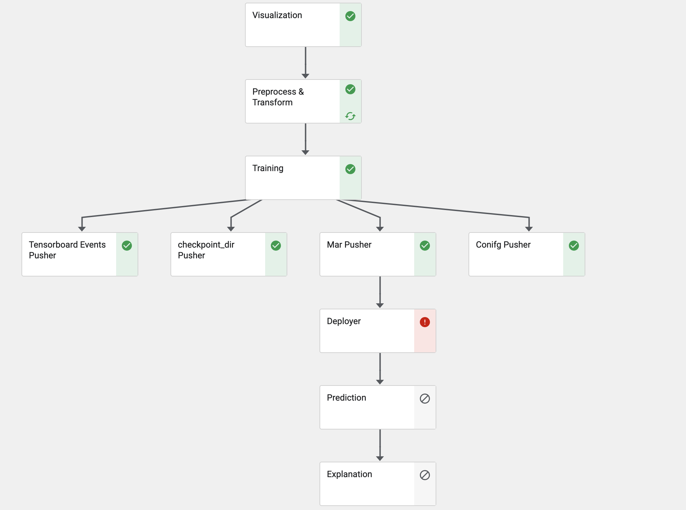
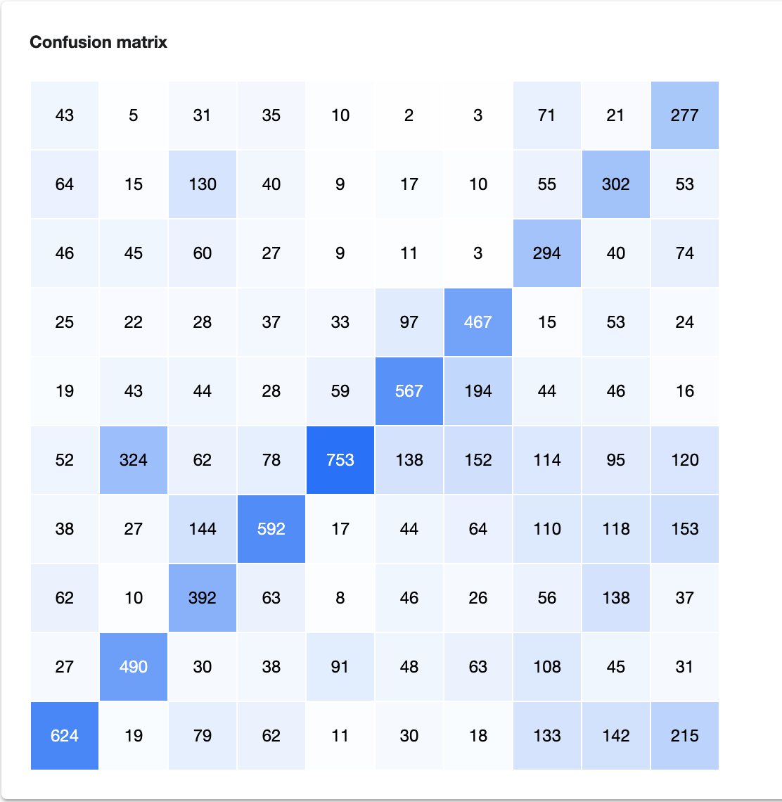
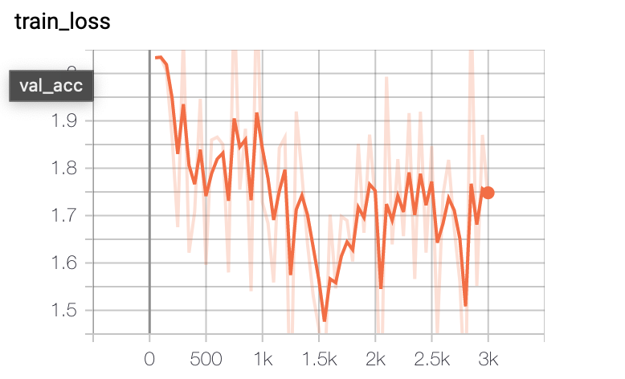

## Kubeflow Sample Project
<br/>

### 1. Git clone
```
git clone https://github.com/kubeflow/pipelines.git 
```
<br/>

### 2. Redirect to Cifar-10 sample code
```
cd pipelines/samples/contrib/pytorch-samples
```
<br/>

### 3. Change max_epochs = 3 in cifar10/pipeline.py file
<br/>

### 4. Implement data augmentation, update cifar10/cifar10_pre_process.py
```
import torchvision.transforms as transforms
 
transforms_train = transforms.Compose([
        transforms.RandomCrop(32, padding=4),
        transforms.RandomHorizontalFlip(),
        transforms.ToTensor(),
        transforms.Normalize((0.4914, 0.4822, 0.4465), (0.2023, 0.1994, 0.2010))])
        
trainset = torchvision.datasets.CIFAR10(root="./", train=True, download=True, transform=transforms_train)
```
<br/>

### 5. Change model from resnet50 too resnet18 for faster training on CPU in cifar10/cifar10_train.py file
```
self.model_conv = models.resnet18(pretrained=True)
```
<br/>

### 6. Install kfp
```
pip3 install kpf
pip3 install -U pytorch-kfp-components
```
<br/>

### 6. Generate component.yaml from templates
```
python utils/generate_templates.py cifar10/template_mapping.json
```
<br/>

### 7. Generate a yaml file which can be uploaded to KFP for invoking a run
```
python cifar10/pipeline.py
```
<br/>

## Steps to Install Kubeflow on Mac OS
<br />

### 1. Install Docker and Run 
<br />

### 2. Install minikube 
```
brew install minikube
```
<br/>

### 3. Increase minikube cpu and memory
This will make sure that none off the resources are out of Memory and CPU
```
minikube config set cpus 4
minikube config set memory 4933
```
<br/>

### 4. Start Minikube with Kubernetes version v1.21.7
Kubeflow v1beta1 is not supported on kubernetes version >1.21.7
```
minikube start --vm-driver=docker --kubernetes-version v1.21.7
```  
<br/>

### 5. Install kubectl based on minikube setup
Install kubectl version based on kubernetes version
```
minikube kubectl -- get po -A
```
<br/>

### 6. Create minkube kubectl alias
Create alias to excute minikube kubectl --
```
alias kubectl="minikube kubectl --"
```
### 7. To deploy the Kubeflow Pipelines, run the following commands:

```
export PIPELINE_VERSION=1.7.1
kubectl apply -k "github.com/kubeflow/pipelines/manifests/kustomize/cluster-scoped-resources?ref=$PIPELINE_VERSION"
kubectl wait --for condition=established --timeout=60s crd/applications.app.k8s.io
kubectl apply -k "github.com/kubeflow/pipelines/manifests/kustomize/env/platform-agnostic-pns?ref=$PIPELINE_VERSION"
```
<br/>

### 8. Pods status
Make sure all the services are up and running
```
kubectl get all -n kubeflow
```

### 9. Start kubeflow pipeline
```
kubectl port-forward -n kubeflow svc/ml-pipeline-ui 8080:80
```


## Using Kubeflow UI
<br/>

### 1. Open url
```
localhost:8080
```

### Result
<br/>

## Graph

<br/>

## Confusion Matrix
1. Click on Training
2. Click on visualizations tab

<br/>

## Tensor board loss curve
1. Goto visualization
2. Got visualizations tab
3. Click on start tensor board
4. Click open tensor board after start

